# Math Data Curation Pipeline

This example demonstrates a complete pipeline for curating mathematical content from Common Crawl, including Common Crawl Index lookup, text preprocessing, quality classification, deduplication, and LLM-based cleanup.

## Install
Use uv to create the project environment and install Curator with the math extra:

```bash
uv sync --extra math_cuda12
source .venv/bin/activate
```

**Note:** GPU detection - if `nvidia-smi` shows GPUs but examples log "No gpus found", `pynvml` may need to be reinstalled:
```bash
uv pip install --force-reinstall pynvml
```

## Prerequisites

### System Dependencies
- A100 or above GPU(s) with CUDA for the Hugging Face model and vLLM
- Python environment with `nemo-curator[math_cuda12]` installed (uv sync above)
- Lynx system dependency for HTML rendering to text:
  - Ubuntu/Debian: `sudo apt-get update && sudo apt-get install -y lynx`
  - RHEL/Fedora: `sudo dnf install -y lynx` (or `sudo yum install -y lynx`)
  - Conda: `conda install -c conda-forge lynx`

### AWS Credentials (for Common Crawl S3 Access)

Downloading the CC Index (Option 1) and fetching WARC content via S3 both require AWS credentials. Common Crawl data is part of the [AWS Open Data Sponsorship Program](https://aws.amazon.com/opendata/open-data-sponsorship-program/) and is free to download — but you still need an AWS account and credentials to authenticate with the `aws s3 cp` command:

```bash
# Option 1: Environment variables
export AWS_ACCESS_KEY_ID=your_access_key
export AWS_SECRET_ACCESS_KEY=your_secret_key

# Option 2: AWS CLI configuration
aws configure
```

See the [AWS CLI documentation](https://docs.aws.amazon.com/cli/latest/userguide/cli-configure-files.html) for more details. If you don't have AWS credentials, you can use the CDX Index via HTTPS as a fallback (see [CC Index Requirements](#common-crawl-cc-index-requirements)).

### Common Crawl (CC) Index Requirements

The index lookup script (`1_cc_index_lookup.py`) uses **cuDF** against a local CC Index in **parquet format**.

**Key points:**
- **Local CC Index required**: Download CC Index parquet files locally for GPU-accelerated joins
- **Parquet format**: The script expects parquet files with columns: `url`, `warc_filename`, `warc_record_offset`, `warc_record_length`, `content_mime_type`, `http_status`
- **Hive partitioning**: Files must be in `<base_path>/crawl=CC-MAIN-YYYY-WW/subset=warc/*.parquet` structure
- **Distributed processing**: Uses Ray for distributed execution across multiple GPUs

**CC Index Access Options:**

| Method | Access | Format | Recommended |
|--------|--------|--------|-------------|
| **Columnar Index (S3)** | Requires AWS credentials | Parquet (ready to use) | ✅ Yes |
| **CDX Index (HTTPS)** | Public, no auth needed | Gzip JSON (needs conversion) | Fallback only |

**Option 1: Columnar Index via S3 (Recommended)**

The CC Index is available as a pre-built parquet table on S3. This is the fastest approach and requires AWS credentials:

```bash
# Download parquet files for a specific crawl (~300 partitions, ~1GB each)
aws s3 cp s3://commoncrawl/cc-index/table/cc-main/warc/crawl=CC-MAIN-2024-10/subset=warc/ \
    /local/path/cc-index/crawl=CC-MAIN-2024-10/subset=warc/ --recursive

# For testing: download just a few partition files
aws s3 cp s3://commoncrawl/cc-index/table/cc-main/warc/crawl=CC-MAIN-2024-10/subset=warc/part-00000.parquet \
    /local/path/cc-index/crawl=CC-MAIN-2024-10/subset=warc/
```

**Option 2: CDX Index via HTTPS**

You can also download CDX files via HTTPS and convert them to parquet. CDX files are gzip-compressed JSON lines.

```bash
# Get the list of CDX files for a crawl:
curl -s https://data.commoncrawl.org/crawl-data/CC-MAIN-2024-10/cc-index.paths.gz | gunzip
```

CDX to parquet conversion requires parsing JSON and extracting the required columns with proper types:
- `url` (string), `warc_filename` (string from `filename` field)
- `warc_record_offset` (int64 from `offset`), `warc_record_length` (int64 from `length`)
- `content_mime_type` (string from `mime`), `http_status` (string from `status`)

## Understanding Index Lookup

Some datasets (OpenWebMath, InfiWebMath, MegaMath) only have URLs without WARC metadata. To fetch their content from Common Crawl, you first need to look up each URL's location in the Common Crawl (CC) Index.

The CC Index is [**publicly available on S3**](https://commoncrawl.org/access-the-data).

### How the Lookup Process Works

```
┌─────────────────────────┐         ┌───────────────────────────┐
│   Your Dataset          │         │   CC Index on S3          │
│   (e.g., OpenWebMath)   │         │   (queried directly)      │
├─────────────────────────┤         ├───────────────────────────┤
│ url                     │         │ url                       │
│ text (optional)         │         │ filename (WARC path)      │
│ ...other columns        │         │ offset (byte position)    │
└───────────┬─────────────┘         │ length (record size)      │
            │                       │ mime, status              │
            │                       └─────────────┬─────────────┘
            │                                     │
            └──────────────┬──────────────────────┘
                           │
                    INNER JOIN ON url
                           │
                           ▼
            ┌──────────────────────────────────────┐
            │        Enriched Dataset              │
            ├──────────────────────────────────────┤
            │ url                    ← original    │
            │ text                   ← original    │
            │ ...other columns       ← original    │
            │ warc_filename          ← from index  │
            │ warc_record_offset     ← from index  │
            │ warc_record_length     ← from index  │
            │ content_mime_type      ← from index  │
            │ http_status            ← from index  │
            └──────────────────────────────────────┘
                           │
                           ▼
            ┌──────────────────────────────────────┐
            │   2_text_preprocess.py --fetch-cc    │
            │   Uses WARC metadata to fetch actual │
            │   content from Common Crawl S3       │
            └──────────────────────────────────────┘
```

**Key Point:** The inner join means only URLs found in the CC Index are kept. URLs not in the specified crawl(s) are dropped.

### CC Index Location

The CC Index is available in two formats:

| Format | Location | Notes |
|--------|----------|-------|
| **Columnar (Parquet)** | `s3://commoncrawl/cc-index/table/cc-main/warc/crawl=CC-MAIN-YYYY-WW/` | Requires AWS credentials |
| **CDX (Gzip JSON)** | `https://data.commoncrawl.org/cc-index/collections/CC-MAIN-YYYY-WW/indexes/` | Public HTTPS access |

Available crawl IDs: https://index.commoncrawl.org/

## Dataset Configuration

Dataset metadata is stored in `datasets.json`. This file is used by `0_download.py` to download datasets from HuggingFace Hub and describes which datasets require CC Index lookup.

Each dataset entry contains:
- `huggingface`: Source repository path for downloading
- `needs_cc_lookup`: Whether CC Index lookup is required (datasets without WARC metadata)
- `url_col`: Column name containing URLs (for datasets needing CC lookup)

### Pre-configured Datasets

| Dataset | HuggingFace Source | Has WARC Metadata | CC Index Lookup Required |
|---------|-------------------|-------------------|-------------------------|
| `FINEMATH_4PLUS` | HuggingFaceTB/finemath | ✅ Yes | No |
| `FINEMATH_3PLUS` | HuggingFaceTB/finemath | ✅ Yes | No |
| `OPENWEBMATH` | open-web-math/open-web-math | ❌ No | Yes |
| `OPC_FINEWEB_MATH` | OpenCoder-LLM/opc-fineweb-math-corpus | ❌ No | Yes |
| `MEGAMATH_PRO` | LLM360/MegaMath | ❌ No | Yes |
| `MEGAMATH_WEB` | LLM360/MegaMath | ❌ No | Yes |

### Custom Dataset Configuration

To add your own dataset, edit `datasets.json`:

```json
{
  "MY_DATASET": {
    "huggingface": "my-org/my-dataset",
    "needs_cc_lookup": true,
    "url_col": "url"
  }
}
```

For datasets with WARC metadata already included, set `"needs_cc_lookup": false` and omit `url_col`.


## Complete Pipeline Flow

**Quick overview:**

```
HuggingFace ──► 0_download ──► Raw Data ──► 1_cc_index_lookup* ──► 2_text_preprocess ──► 3_llm_cleanup ──► 4_quality_classifier ──► 5_deduplication ──► Final Data
                                                   ▲                        ▲
                                              CC Index (S3)          Common Crawl (S3)

* Step 1 only needed for datasets without WARC metadata (OpenWebMath, MegaMath, etc.)
```

<details>
<summary>Detailed pipeline diagram (click to expand)</summary>



</details>

```mermaid
flowchart TD
    subgraph download["Download (Optional)"]
        HF[("HuggingFace Hub")]
        DL["0_download.py"]
        RAW["Raw Parquet Files<br/><i>$MATH_DATA_DIR/raw/</i>"]
    end

    subgraph datasets["Input Datasets"]
        D1["FineMath 3+/4+<br/><i>Has WARC metadata</i>"]
        D2["OpenWebMath<br/>InfiWebMath<br/>MegaMath<br/><i>URL only</i>"]
    end

    subgraph step1["Step 1: CC Index Lookup"]
        CC_INDEX[("CC Index on S3<br/>s3://commoncrawl/cc-index/")]
        LOOKUP["1_cc_index_lookup.py"]
        ENRICHED["Enriched Dataset<br/><i>+ warc_filename</i><br/><i>+ offset, length</i>"]
    end

    subgraph step2["Step 2: Text Preprocessing"]
        CC_S3[("Common Crawl S3<br/>s3://commoncrawl/crawl-data/")]
        EXTRACT["2_text_preprocess.py<br/>--fetch-cc"]
        PREPROCESSED["Preprocessed Data<br/><i>text, url, type</i>"]
    end

    subgraph step3["Step 3: LLM Cleanup"]
        LLM["3_llm_cleanup.py<br/><i>vLLM + Phi-4</i>"]
        FINAL["Cleaned Data<br/><i>+ cleaned_text</i>"]
    end

    subgraph step4["Step 4: Quality Classification"]
        CLASSIFY["4_quality_classifier.py<br/><i>FineMath model</i>"]
        CLASSIFIED["Classified Data<br/><i>+ finemath_scores</i>"]
    end

    subgraph step5["Step 5: Deduplication"]
        DEDUP["5_deduplication.py<br/><i>Fuzzy matching</i>"]
        DEDUPED["Deduplicated Data"]
    end

    %% Download flow (optional)
    HF -->|"Download"| DL
    DL --> RAW
    RAW --> D1
    RAW --> D2

    %% Flow for datasets WITH WARC metadata
    D1 -->|"Has warc_filename,<br/>offset, length"| EXTRACT

    %% Flow for datasets WITHOUT WARC metadata
    D2 -->|"URL only"| LOOKUP
    LOOKUP <-->|"Query"| CC_INDEX
    LOOKUP --> ENRICHED
    ENRICHED --> EXTRACT

    %% Common flow after preprocessing
    EXTRACT <-->|"Fetch from Common Crawl<br/><i>HTTPS range requests</i>"| CC_S3
    EXTRACT --> PREPROCESSED
    PREPROCESSED --> LLM
    LLM --> FINAL
    FINAL --> CLASSIFY
    CLASSIFY --> CLASSIFIED
    CLASSIFIED --> DEDUP
    DEDUP --> DEDUPED

    %% ==========================================
    %% NVIDIA Color Scheme
    %% ==========================================
    %% Primary Green (#76b900): Python scripts / processing tools
    %% Dark Gray (#666666): Input and final datasets
    %% Light Gray (#999999): Intermediate outputs
    %% Purple (#7b68ee): Data stores, S3 buckets (cylinders)
    %% All boxes have black borders (#000000)

    classDef nvidiaGreen fill:#76b900,stroke:#000000,color:white,stroke-width:2px
    classDef nvidiaGray fill:#666666,stroke:#000000,color:white,stroke-width:2px
    classDef nvidiaLightGray fill:#999999,stroke:#000000,color:white,stroke-width:2px
    classDef nvidiaPurple fill:#c9b8e6,stroke:#000000,color:#333,stroke-width:2px

    %% Apply NVIDIA colors to nodes
    %% Input datasets - Gray
    class D1,D2 nvidiaGray

    %% External data stores - Purple (cylinders)
    class HF,CC_INDEX,CC_S3 nvidiaPurple

    %% Processing steps (Python scripts) - NVIDIA Green
    class DL,LOOKUP,EXTRACT,LLM,CLASSIFY,DEDUP nvidiaGreen

    %% Intermediate outputs - Light Gray
    class RAW,ENRICHED,PREPROCESSED,FINAL,CLASSIFIED nvidiaLightGray

    %% Final output - Gray
    class DEDUPED nvidiaGray

    %% Subgraph styling (Note: subgraph styling support varies by renderer)
    style download fill:transparent,stroke:#000000,stroke-width:2px,stroke-dasharray:5 5,color:#333
    style datasets fill:transparent,stroke:#000000,stroke-width:2px,color:#333
    style step1 fill:transparent,stroke:#000000,stroke-width:2px,color:#333
    style step2 fill:transparent,stroke:#000000,stroke-width:2px,color:#333
    style step3 fill:transparent,stroke:#000000,stroke-width:2px,color:#333
    style step4 fill:transparent,stroke:#000000,stroke-width:2px,color:#333
    style step5 fill:transparent,stroke:#000000,stroke-width:2px,color:#333

    %% Link/Arrow styling (Note: linkStyle support varies by renderer)
    linkStyle default stroke:#76b900,stroke-width:2px
```

### Pipeline Summary

| Step | Script | Input | Output | Required For |
|------|--------|-------|--------|--------------|
| 0 | `0_download.py` | HuggingFace | Raw parquet files | Optional (if data not already available) |
| 1 | `1_cc_index_lookup.py` | URLs | URLs + WARC metadata | Datasets without WARC metadata |
| 2 | `2_text_preprocess.py` | WARC metadata | Extracted text | All datasets |
| 3 | `3_llm_cleanup.py` | Preprocessed text | Cleaned text (merged) | Optional |
| 4 | `4_quality_classifier.py` | Text | Text + quality scores | All datasets |
| 5 | `5_deduplication.py` | Scored text | Deduplicated text | All datasets |

### Working Directory Setup

```bash
# Create working directories
export MATH_DATA_DIR=/tmp/math_pipeline
mkdir -p $MATH_DATA_DIR/{raw,enriched,preprocessed,cleaned,classified,dedup_cache,dedup_ids,deduplicated}
```

## Download Dataset from HuggingFace (Optional)

**Skip this step if you already have the dataset downloaded locally.**

The `0_download.py` script downloads math datasets from HuggingFace Hub. It reads dataset configurations from `datasets.json` and downloads parquet files to `$MATH_DATA_DIR/raw/<dataset_name>/`.

### HuggingFace Authentication

Several steps in this pipeline require a HuggingFace token:
- **Step 0**: Downloading gated datasets (e.g., some FineMath splits)
- **Step 4**: The FineMath quality classifier model (`HuggingFaceTB/finemath-classifier`)

**Set up your token before starting the pipeline:**

```bash
# Option 1: Environment variable (recommended)
export HF_TOKEN=hf_xxxxxxxxxxxxxxxxxxxxxxxxxxxxx

# Option 2: CLI login (saves token to ~/.cache/huggingface/token)
huggingface-cli login
```

Get your token at: https://huggingface.co/settings/tokens

> **Note:** A missing or invalid token typically produces a "repository not found" error rather than an explicit authentication error. If you see this error, verify your `HF_TOKEN` is set and valid.

### Download Commands

```bash
# List available datasets
python tutorials/math/0_download.py --list

# Download a specific dataset
python tutorials/math/0_download.py \
    --dataset FINEMATH_4PLUS \
    --output-dir $MATH_DATA_DIR/raw

# Download multiple datasets
python tutorials/math/0_download.py \
    --dataset FINEMATH_4PLUS OPENWEBMATH \
    --output-dir $MATH_DATA_DIR/raw

# Download only a few files for testing
python tutorials/math/0_download.py \
    --dataset FINEMATH_4PLUS \
    --output-dir $MATH_DATA_DIR/raw \
    --max-files 5

# Parallel download with 8 workers (recommended for large datasets)
python tutorials/math/0_download.py \
    --dataset FINEMATH_4PLUS \
    --output-dir $MATH_DATA_DIR/raw \
    --workers 8
```

**Output structure:**
```
$MATH_DATA_DIR/raw/
├── finemath_4plus/
│   ├── train-00000-of-00XXX.parquet
│   ├── train-00001-of-00XXX.parquet
│   └── ...
└── openwebmath/
    └── ...
```

**Dataset sizes (approximate):**
| Dataset | Tokens | Notes |
|---------|--------|-------|
| FINEMATH_4PLUS | ~9.5B | High-quality math (score ≥4) |
| FINEMATH_3PLUS | ~30B | Good quality math (score ≥3) |
| OPENWEBMATH | ~14B | Requires CC Index lookup |

## Step 1: CC Index Lookup (For Datasets Without WARC Metadata)

**Skip this step if your dataset already has WARC metadata** (like FineMath).

For datasets that only have URLs (OpenWebMath, InfiWebMath, MegaMath), enrich them with WARC metadata by joining against a local CC Index.

### Download CC Index

Download CC Index parquet files for the crawl(s) you need. See [CC Index Requirements](#common-crawl-cc-index-requirements) for download options and required schema.

### Run CC Index Lookup

```bash
# Run CC Index lookup (auto-detects all available crawls)
python tutorials/math/1_cc_index_lookup.py \
    --input $MATH_DATA_DIR/raw/openwebmath \
    --output $MATH_DATA_DIR/enriched \
    --cc-index-path $CC_INDEX_DIR

# Or specify specific crawls
python tutorials/math/1_cc_index_lookup.py \
    --input $MATH_DATA_DIR/raw/openwebmath \
    --output $MATH_DATA_DIR/enriched \
    --cc-index-path $CC_INDEX_DIR \
    --crawls CC-MAIN-2024-10 CC-MAIN-2024-18
```

**Output columns added:**

| Column | Description | Example |
|--------|-------------|---------|
| `warc_filename` | Path to WARC file | `crawl-data/CC-MAIN-2024-10/.../CC-MAIN-...warc.gz` |
| `warc_record_offset` | Byte offset in WARC | `123456789` |
| `warc_record_length` | Record size in bytes | `45678` |
| `content_mime_type` | MIME type | `text/html` |
| `http_status` | HTTP status code | `200` |

## Step 2: Text Preprocessing (decode → type-detect → extract)

Extract and preprocess text from raw web data:

```bash
# For datasets with WARC metadata (FineMath, or after CC Index lookup)
# Uses --fetch-cc to download content from Common Crawl (HTTPS by default; set CC_USE_S3=1 to use S3)
python tutorials/math/2_text_preprocess.py \
    --input "$MATH_DATA_DIR/enriched/*.parquet" \
    --output $MATH_DATA_DIR/preprocessed \
    --fetch-cc

# For local data with binary_content column already present (no fetch needed)
python tutorials/math/2_text_preprocess.py \
    --input "$MATH_DATA_DIR/local/*.parquet" \
    --output $MATH_DATA_DIR/preprocessed

# Optional: Add --report-stats to see extraction statistics
python tutorials/math/2_text_preprocess.py \
    --input "$MATH_DATA_DIR/enriched/*.parquet" \
    --output $MATH_DATA_DIR/preprocessed \
    --fetch-cc \
    --report-stats
```

**Common Crawl fetch env vars (used by `CommonCrawlWARCReader`):**

- `CC_USE_S3`: Set to `1`/`true`/`yes` to use S3 range requests; default is HTTPS.
- `CC_S3_BUCKET`: Override bucket name (default: `commoncrawl`).
- `CC_S3_KEY_PREFIX`: Optional prefix to strip from `warc_filename` when building S3 object key.

**Input**: Parquet files with either:
- `warc_filename`, `warc_record_offset`, `warc_record_length` columns → use `--fetch-cc` to download from Common Crawl
- `binary_content` (bytes) column → content already present, no fetch needed

**Output**: JSONL files with columns: `text`, `url`, `type`

## Step 3: LLM Cleanup

Clean and refine text using a large language model. This step uses vLLM for efficient inference and requires a GPU. When `--chunk_data` is enabled, documents are split into chunks, cleaned by the LLM, then merged back into one row per document.

```bash
python tutorials/math/3_llm_cleanup.py \
  --input $MATH_DATA_DIR/preprocessed \
  --output $MATH_DATA_DIR/cleaned \
  --model microsoft/phi-4 \
  --prompt HTML_TO_TEXT_PROMPT \
  --chunk_data \
  --chunk_length 5000 \
  --max_model_len 16384 \
  --input_filetype jsonl
```

**Input**: JSONL files from Step 2

**Output**: JSONL files with `cleaned_text` (LLM-processed text). When chunking is enabled, chunks are automatically merged back into one row per document.

**Key flags**:
- `--chunk_data` / `--chunk_length`: Enable token-based chunking before LLM processing. **These flags must be used together** — `--chunk_length` is required when `--chunk_data` is set, and `--max_model_len` is also required for chunking.
- `--prompt`: Name of the prompt to use. See [Available Prompts](#available-prompts) for the full list and selection guidance.
- `--groupby`: Columns to group by for chunk merging (default: `url`)
- `--max_text_length`: Maximum merged text length in chars (default: 900,000)
- `--classification`: Output classification labels instead of cleaned text
- `--temperature`, `--top_p`, `--top_k`, `--min_p`: Sampling parameters

## Step 4: Quality Classification

Classify mathematical content quality using the FineMath model:

```bash
python tutorials/math/4_quality_classifier.py \
  --input "$MATH_DATA_DIR/cleaned/*.jsonl" \
  --output $MATH_DATA_DIR/classified
```

**Input**: JSONL files from Step 3. The classifier reads from the `text` field by default; use `--text-field cleaned_text` if your data was processed by the LLM cleanup step.

**Output**: JSONL files with additional columns:
- `finemath_scores`: float scores (0.0–5.0)
- `finemath_int_scores`: integer scores (0–5)

**Interpreting quality scores:**

| Score | Interpretation |
|-------|----------------|
| 0 | No mathematical content |
| 1 | Minimal or tangential math content |
| 2 | Some math content but low quality (e.g., poorly formatted, incomplete) |
| 3 | Moderate quality math content — usable for general training |
| 4 | High quality math content — well-structured and educational |
| 5 | Excellent math content — textbook-quality, clear explanations |

As a guideline, the pre-configured FineMath datasets use score thresholds of ≥3 (`FINEMATH_3PLUS`) and ≥4 (`FINEMATH_4PLUS`). A threshold of ≥3 is a reasonable starting point; use ≥4 for higher-quality, smaller datasets.

## Step 5: Deduplication

Remove duplicate content using fuzzy deduplication:

```bash
python tutorials/math/5_deduplication.py \
  --input $MATH_DATA_DIR/classified \
  --cache_dir $MATH_DATA_DIR/dedup_cache \
  --duplicate_ids_dir $MATH_DATA_DIR/dedup_ids \
  --output $MATH_DATA_DIR/deduplicated \
  --input_filetype jsonl
```

**Input**: JSONL files from Step 4

**Output**: Deduplicated JSONL files

**Process**: Deduplication takes place in two stages:
1. First stage: Duplicate IDs are identified and saved to `duplicate_ids_dir`
2. Second stage: Duplicates are removed from the dataset

> **Important:** The `cache_dir` **must be manually cleared between runs**. Stale cache files from a previous run will cause incorrect results. Delete or empty the cache directory before re-running:
> ```bash
> rm -rf $MATH_DATA_DIR/dedup_cache/*
> ```

**LSH parameters** (tunable via command-line flags):

| Flag | Default | Description |
|------|---------|-------------|
| `--char_ngrams` | 24 | Character n-gram size for MinHash. Values below 20 may produce ~5% false positives. |
| `--num_bands` | 20 | Number of LSH bands. More bands = higher recall but slower. |
| `--minhashes_per_band` | 13 | Hashes per band. More hashes = higher precision but lower recall. |
| `--bands_per_iteration` | 5 | Number of bands to shuffle concurrently. Reduce if you hit OOM errors. |
| `--use_64_bit_hash` | False | Use 64-bit hash for fewer collisions on very large datasets. |
| `--seed` | 42 | Seed for MinHash permutations (for reproducibility). |

The similarity threshold is implicitly controlled by `num_bands` and `minhashes_per_band`. The approximate threshold is `(1/num_bands)^(1/minhashes_per_band)`. With the defaults (20 bands, 13 hashes/band), this is approximately 0.79. To detect more similar pairs (stricter dedup), increase `num_bands`; to be more lenient, decrease it.

## Available Prompts

The LLM cleanup step (`3_llm_cleanup.py`) supports 12 prompts via the `--prompt` flag. The prompt is loaded by name from `nemo_curator.utils.prompts`.

### Content Cleaning Prompts

Use these for extracting and cleaning text from raw HTML/web content:

| Prompt | Use Case | When to Choose |
|--------|----------|----------------|
| **`HTML_TO_TEXT_PROMPT`** (default) | Extract main content, preserve math, standardize equations to LaTeX `$...$`, remove boilerplate | General-purpose math content extraction |
| **`HTML_TO_TEXT_PROMPT_CODE`** | Same as above but also preserves code blocks | Pages mixing math and significant code (e.g., computational math tutorials, Jupyter-style content) |

```bash
# Example: cleaning code-heavy math content
python tutorials/math/3_llm_cleanup.py \
  --input $MATH_DATA_DIR/preprocessed \
  --output $MATH_DATA_DIR/cleaned_code \
  --model microsoft/phi-4 \
  --prompt HTML_TO_TEXT_PROMPT_CODE \
  --chunk_data \
  --chunk_length 5000 \
  --max_model_len 16384 \
  --input_filetype jsonl
```

### Classification Prompts

Use these with `--classification` to label content rather than clean it:

| Prompt | Use Case |
|--------|----------|
| **`MATH_TOPIC_CLASSIFICATION_PROMPT`** | Classifies content into topics: Math, CS, Physics, Statistics, Chemistry, Economics, or Other |
| **`CODE_QUALITY_PROMPT`** | Rates code quality on a 0–5 scale with detailed criteria |
| **`CODE_QUALITY_PROMPT_SIMPLIFIED`** | Rates code quality on a 0–2 scale (simpler/faster) |

```bash
# Example: classify math topics
python tutorials/math/3_llm_cleanup.py \
  --input $MATH_DATA_DIR/preprocessed \
  --output $MATH_DATA_DIR/classified_topics \
  --model microsoft/phi-4 \
  --prompt MATH_TOPIC_CLASSIFICATION_PROMPT \
  --classification \
  --max_model_len 16384 \
  --input_filetype jsonl
```

### Synthetic Dialogue Prompts (MIND Dataset)

These prompts convert source text into multi-turn dialogue formats, based on the [MIND paper](https://arxiv.org/pdf/2410.12881). Useful for generating conversational training data from math content:

| Prompt | Format |
|--------|--------|
| **`mind_two_profs`** | Discussion between two professors |
| **`mind_teacher_student`** | Teacher-student Q&A |
| **`mind_two_students`** | Two students discussing an assignment |
| **`mind_interview`** | Interview with an expert |
| **`mind_problem_solving`** | Problem-solving conversation |
| **`mind_layman_knowall`** | Expert explaining to a layperson |
| **`mind_debate`** | Debate-style discussion |

## Troubleshooting

### 0 URLs Matched in CC Index Lookup (Step 1)

- Verify your CC Index parquet files follow the required hive-partitioned directory structure: `<base_path>/crawl=CC-MAIN-YYYY-WW/subset=warc/*.parquet`
- Check that the crawl ID(s) you downloaded actually contain your URLs. Not all URLs appear in every crawl — try multiple crawls.
- Confirm the `url_col` in `datasets.json` matches the actual column name in your dataset.

### Empty LLM Output (Step 3)

- Check that `--max_model_len` is large enough for your input chunks. The script filters out chunks that exceed 80% of `max_model_len`.
- Verify the model downloaded successfully and you have sufficient VRAM (~20 GB for Phi-4).
- Try a smaller `--chunk_length` value if documents are being dropped.

### All Classifier Scores Are 0 (Step 4)

- Ensure you're using the correct `--text-field`. After LLM cleanup, the text is in `cleaned_text`, not `text`:
  ```bash
  python tutorials/math/4_quality_classifier.py \
    --input "$MATH_DATA_DIR/cleaned/*.jsonl" \
    --output $MATH_DATA_DIR/classified \
    --text-field cleaned_text
  ```
- Verify the input files are not empty and contain the expected text field.

### Common Crawl S3 Fetch Failures (Step 2)

- If using S3 (`CC_USE_S3=1`), ensure your AWS credentials are configured — see [AWS Credentials](#aws-credentials-for-common-crawl-s3-access).
- HTTPS fetching (the default) does not require AWS credentials but may be slower.
- Malformed WARC records are skipped silently. Use `--report-stats` to see extraction statistics and identify how many records failed.

### Deduplication Errors (Step 5)

- If results seem incorrect, ensure you cleared `cache_dir` from any previous run: `rm -rf $MATH_DATA_DIR/dedup_cache/*`
- Out-of-memory errors: try reducing `--bands_per_iteration` (default: 5) to process fewer bands concurrently.
